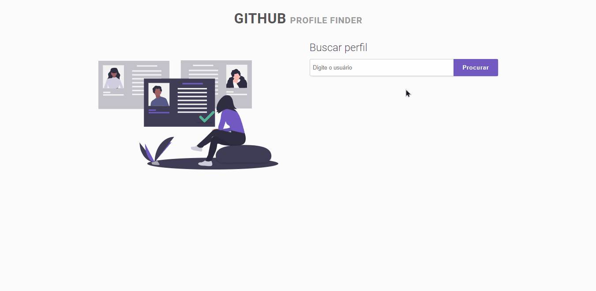

<h1 align="center">
 
  
 
 
Profile Finder
</h1>

Localizador de perfil do GitHub.

  
  
  
  
  

  

---

 

## Licença

 

Esse projeto está sob a licença MIT. Veja o arquivo [LICENSE](/LICENSE) para mais detalhes.

---

Feito com :purple_heart: by [Rafael Martins](https://github.com/martins-rafael)